# T3A2-A Katie Lock and Nate Picone

## You work hard. We'ppreciate you.

### We'ppreciate - a full stack MERN application

## R1 Purpose

A leader in the Fast Moving Consumer Goods industry approached us with a problem.

They have a monthly employee reward and recognition program for a key business unit, Business Services. Anyone in the business can nominate anyone in Business Services. They want to expand the program so that anyone from the wider business can be nominated, but have some issues they want to overcome first.

### The problem

After a requirements discussion with the client, and some analysis of the existing system, we aligned with the client that:

- Completing a nomination through a Microsoft Form is not easy, it lacks an engaging experience, and that a custom web interface is preferable;
- Finding the location of the Microsoft Forms is difficult, and a linkable domain name would be helpful;
- The monthly process of extracting the nominations from Microsoft Excel, preparing the list for review, then manually building PowerPoint slides for presentation and sharing the data with relevant parties could use some improvement;
- The business has a complicated structure of employees and vendor partner workers, who are also eligible for awards, and providing the nomination and award winners' data to the vendor partners has been manual and prone to human error. A method of giving the vendor partners access to the data would be helpful;
- Nomination and award recipients have no persistent record of the nomination or award, which creates a feeling that the celebration is fleeting, and a method for recipients to be able to keep the details of the award would be helpful for the employee's satisfaction, and for their development and performance review discussions;
- Likewise, those who submit nominations have no record of having done so, creating unease around whether their nomination was successful and leaving no way of nominators checking who they have nominated in the past;
- There is no formalised way of expressing and sharing thanks to an individual for actions that are appreciated but not substantial enough for an award nomination;

### The reason

Celebrating the success of people within business is important for engagement, which can translate to higher employee retention, and renewed efforts of those who have been recognised, as well as within their peers.

According to a 2019 [Deloitte study](https://www2.deloitte.com/content/dam/Deloitte/us/Documents/about-deloitte/us-about-deloitte-the-practical-magic-of-thank-you-june-2019.pdf):

- 68% of respondent prefer a non-financial reward, such as recognition;
- 40% of respondents like their success to be the reason they are recognised (46% of male respondents; 34% of female respondents).

> ...… one study found employees receiving small rewards and thanks were eight times more engaged than those receiving compensation and bonus increases once a year.

*[Deloitte](https://www2.deloitte.com/content/dam/Deloitte/us/Documents/about-deloitte/us-about-deloitte-the-practical-magic-of-thank-you-june-2019.pdf), p23*

> “I want the recognition to match the level of work. Small things don’t need to be shared with the broader team. Big things should be recognized to higher levels.“

*[Deloitte](https://www2.deloitte.com/content/dam/Deloitte/us/Documents/about-deloitte/us-about-deloitte-the-practical-magic-of-thank-you-june-2019.pdf), p21*

### The proposal

We will build a full stack MERN web application, as a pilot, allowing for the current award system structure (anyone from the business can nominate anyone in Business Services), with the ability for the client to easily upscale for future, full-business expansion.

The web app will offer services to cater to the user stories, identified below. In summary, the main groups of users are:

1. Anyone with an email address with one of the business' domains can access the site, to view Business Services people’s profiles, to nominate, or to send a form of instant thanks.
1. Anyone within Business Services can be nominated or receive a form of instant thanks. This group will:
	- have a customisable profile,
	- have a feed of others' nominations, awards and instant thanks to view and interact with,
	- have a persistent record of nominations, awards and instant thanks received,
	- also be able to nominate others within Business Services.
1. Senior Managers will be able to review, group, reject, or progress nominations to awards.
1. Line Managers will have a rolled-up view of cards, nominations and awards received by thier team members.
1. Administrators will be able to have wide data viewing, updating, deleting, and creation abilities, including to change user details, add and remove profiles, add and remove nominations, and and remove authorisation.

Were this project to be implemented, the client would be encouraged to run promotional activity for implementation and staff engagement. We suggest identifying stakeholders, and a group of people for User Acceptance Testing and user experience feedback.

> [!NOTE]
> Viewable on [We'ppreciate's Notion site - Product Requirements Document](https://weppreciate.notion.site/Product-Requirements-Document-1a4fc83d4ca94759987db15e73e52171?pvs=4)

### Competitor research

We looked into currently available alternative solutions, and this search returned several inspirational points that we liked, and some opportunities for points of difference.

We decided our application should be light in its interface, with muted and warm colour blocks. This would give users of the site a warm, comforting feeling, while allowing bolder colours associated with the awards and people to take focus.

Some competitors offer integration with communication apps, such as Slack, which we found interesting - but agreed this was outside the scope of the project.

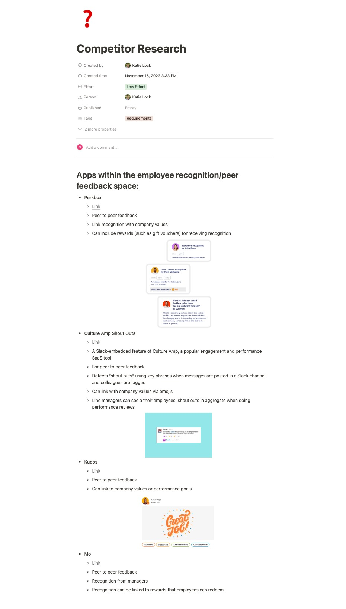

> [!NOTE]
> Viewable on [We'ppreciate's Notion site - Competitor Research](https://weppreciate.notion.site/https://weppreciate.notion.site/Competitor-Research-24071f8e8bce49a79e71c982f9db55ba?pvs=4)

#### Branding, look and feel

Our client has strong primary colours for its branding, and equally strong secondary colours for its values. We like the colours and their association, but felt they risked pulling the focus away from people and achievements. As a solution to this, we decided to use the client's secondary colours as a starting point, and both desaturate and lighten them, resulting in pastel versions of those colours:

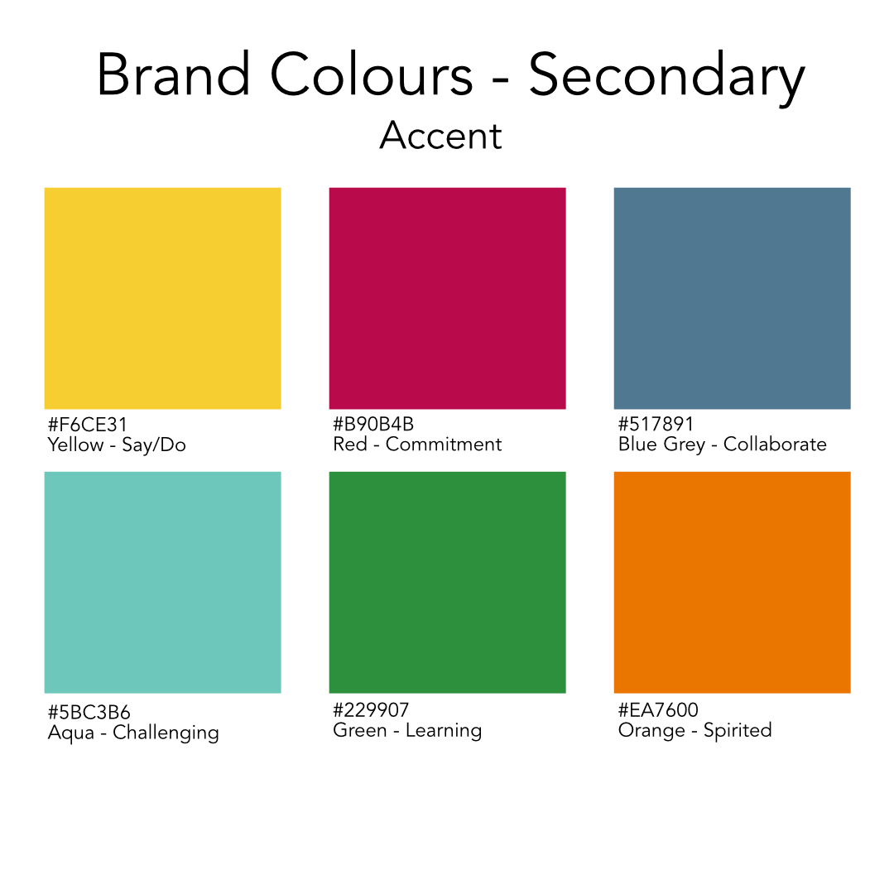

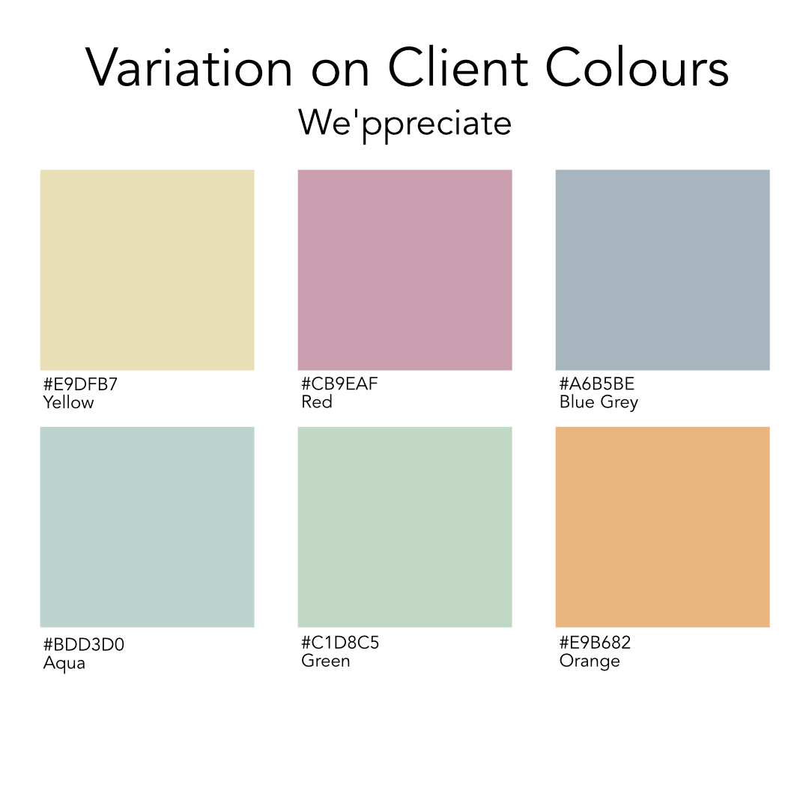

We created a unique logo for We'ppreciate that incorporated some of these colours, but also represented "togetherness" in the way that the W loops and unites:

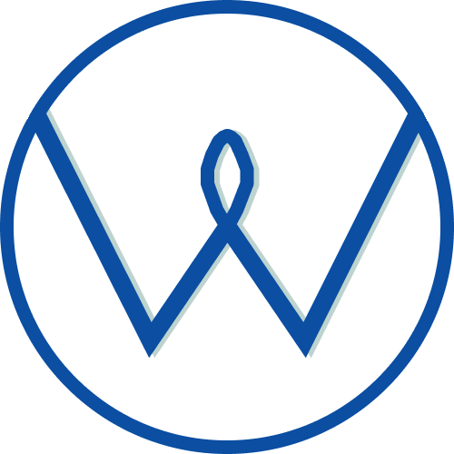

> [!NOTE]
> Viewable on [We'ppreciate's Notion site - Brand Design](https://weppreciate.notion.site/Brand-Design-cb65efea9fe84dfab495aea999f27a22?pvs=4)

## R4 User Stories

### The user story format

We used [Atlassian's](https://www.atlassian.com/agile/project-management/user-stories) format of: **As a \[persona\], I \[want to\], \[so that\].**

Breaking this down:

- **"As a \[persona\]":** Who are we building this for? We’re not just after a job title, we’re after the persona of the person. Max. Our team should have a shared understanding of who Max is. We’ve hopefully interviewed plenty of Max’s. We understand how that person works, how they think and what they feel. We have empathy for Max.
- **“Want to”:** Here we’re describing their intent — not the features they use. What is it they’re actually trying to achieve? This statement should be implementation free — if you’re describing any part of the UI and not what the user goal is you're missing the point.
- **“So that”:** how does their immediate desire to do something this fit into their bigger picture? What’s the overall benefit they’re trying to achieve? What is the big problem that needs solving?

> [!NOTE]
> Viewable on [We'ppreciate's Notion site - User Stories](https://weppreciate.notion.site/User-Stories-b41b48c301e34f498625f1c724df3976)

### The personas

To give our user stories the true “persona” effect, here are some defined personas that represent a variety of users/stakeholders within the organisation:

| **Name**   | **Role within organisation**               | **User role in application** | **Bio**
| ------ | ---------------------------------------------- | ------------------------ |---------------|
| Nate   | Individual contributor, Business Services team | Employee (Full access)   | Employee (Full)	A high achiever in the Business Services team, Nate is strongly motivated by words of affirmation from his peers and leaders.
| Ed     | Line manager, Business Services team           | Line Manager             | Ed is a new manager in Business Services and is trying to build relationships with and understand the achievements of his direct reports.
| Katie  | HR Business Partner, Business Services team    | Administrator            | Katie is a strong advocate for implementing technology to uplift and enhance HR initiatives.
| Naomi  | Individual contributor, Sales team             | Employee (Basic access)  | Naomi is often on the road and has terrible luck with IT, so she’s built some great relationships with Business Services as they help keep her operational.
| Hannah | Senior manager, Business Services team         | Senior Manager           | Hannah knows that her people are providing great value and work across the business every day, but she wants to see more visible recognition and higher participation in nominations for monthly awards.

Some user stories will apply to multiple or all personas.

> [!NOTE]
> Viewable on [We'ppreciate's Notion site - User Stories](https://weppreciate.notion.site/User-Stories-b41b48c301e34f498625f1c724df3976)

### The user stories

The core functionality of the application form the *acceptable criteria* in the user stories

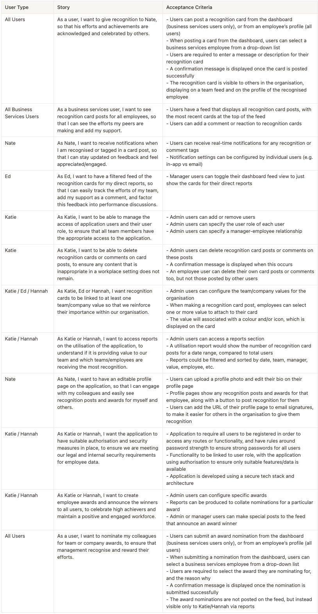

> [!NOTE]
> Viewable on [We'ppreciate's Notion site - User Stories](https://weppreciate.notion.site/User-Stories-b41b48c301e34f498625f1c724df3976)

### The Stack

We intend to solve these issues with a full stack MERN web application, harnessing:

#### Front end:
- [ReactJS](https://react.dev/)
- [Javascript](https://www.javascript.com/)
- [HTML5](https://developer.mozilla.org/en-US/docs/Glossary/HTML5)
- [SCSS](https://sass-lang.com/) or [Material UI](https://mui.com/)
- [CSS3](https://developer.mozilla.org/en-US/docs/Web/CSS)

#### Database:
- [MongoDB (Atlas platform)](https://www.mongodb.com/)

#### Object Document Mapping:
- [Mongoose](https://mongoosejs.com/docs/)

#### Back end:
- [Node.js](https://nodejs.org/en/)
- [ExpressJS](https://expressjs.com/)

#### Package Management:
- [npm](https://www.npmjs.com/)

#### Testing:

Currently evaluating between:
- [Jest](https://jestjs.io/)
- [msjws](https://mswjs.io/)
- [Cypress](https://www.cypress.io/)

#### Diagramming:
- [draw.io](http://draw.io/)

#### Project Management:
- [Notion](http://notion.so)

#### DevOps: 
- [Visual Studio Code](https://code.visualstudio.com/)
- [Git](https://git-scm.com/doc)
- [GitHub](https://github.com/)

#### Hosting:
- [Netlify](https://www.netlify.com/) - front end hosting
- [Heroku](https://dashboard.heroku.com/) - back end hosting

#### Resource File Storage:
- [Google Drive](https://www.google.com/intl/en_au/drive/)

#### Design applications and services
- [Figma](https://www.figma.com/)
- [Affinity Designer](https://affinity.serif.com/en-gb/designer/)

> [!NOTE]
> Viewable on [We'ppreciate's Notion site - Product Requirements Document](https://weppreciate.notion.site/Product-Requirements-Document-1a4fc83d4ca94759987db15e73e52171?pvs=4)

## R2 - Dataflow

### Context Diagram (Overview of the system)

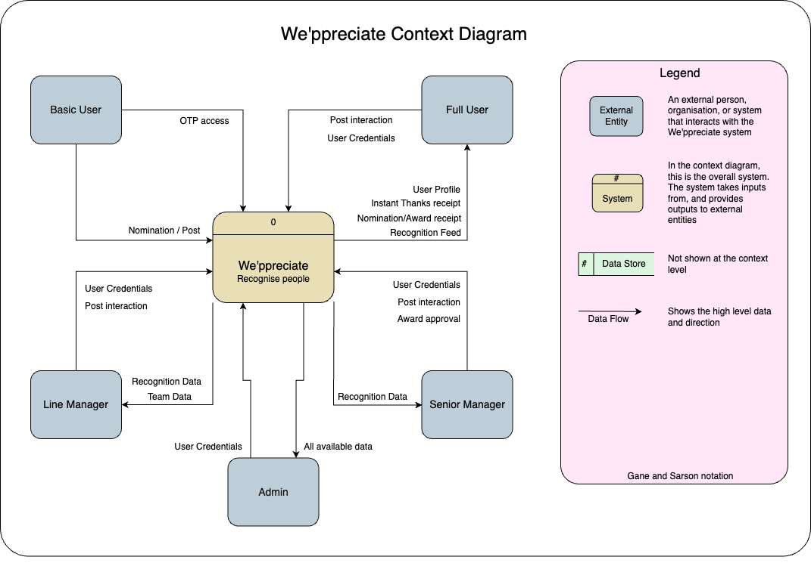

### Dataflow Diagram

We started with a draft tangle of connections which became progressively hard to read as more processes and data stores were added:

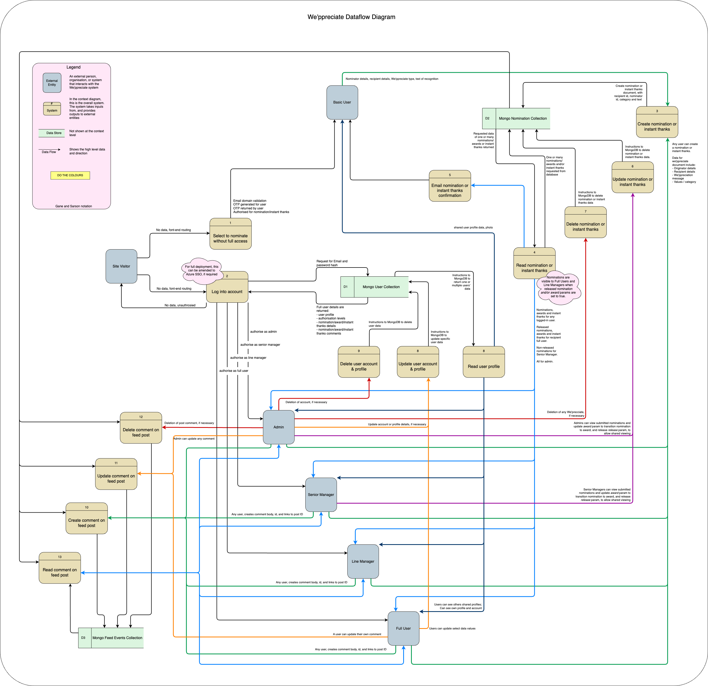

After some flow chart refactoring, there were some improvements, when we realised that Full User, Senior Manager, Line Manager, and Admin were all Full Users, with various privileges:

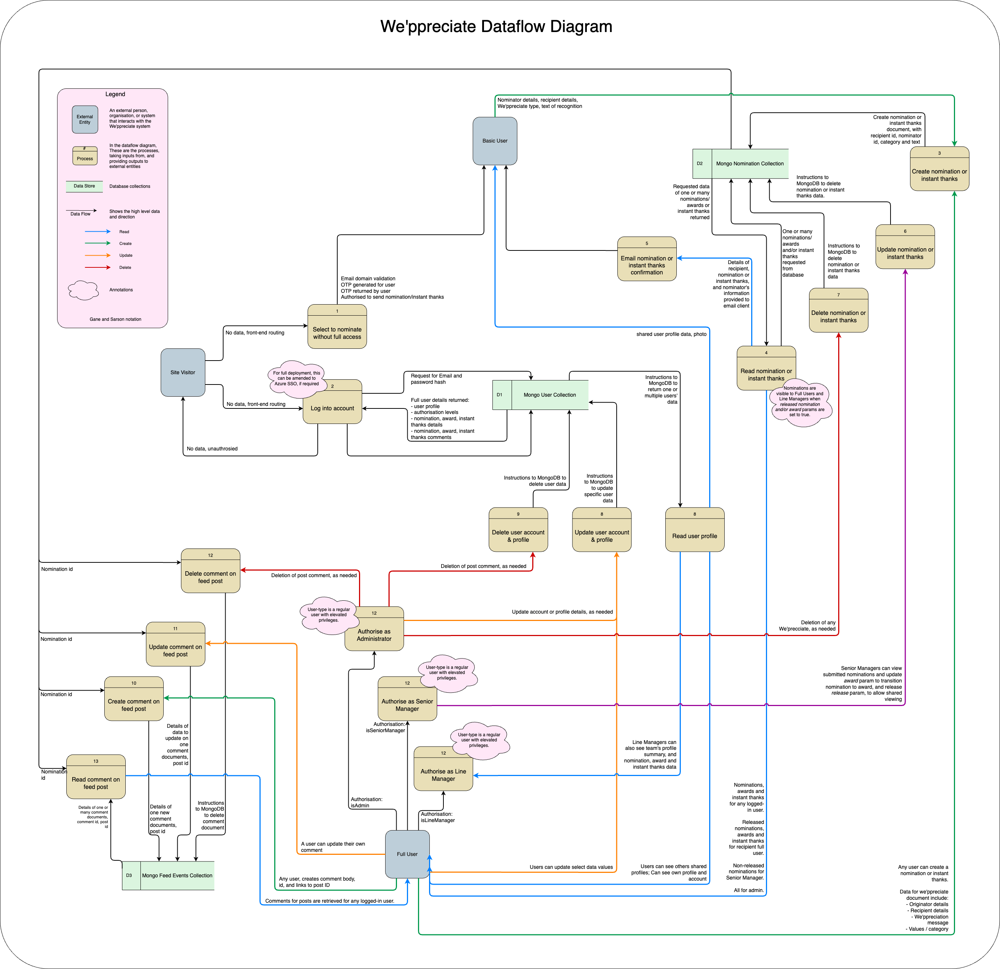

And finally, a further refactor and annotations, after AWS S3 data stores were added for user images, and nomination values images:

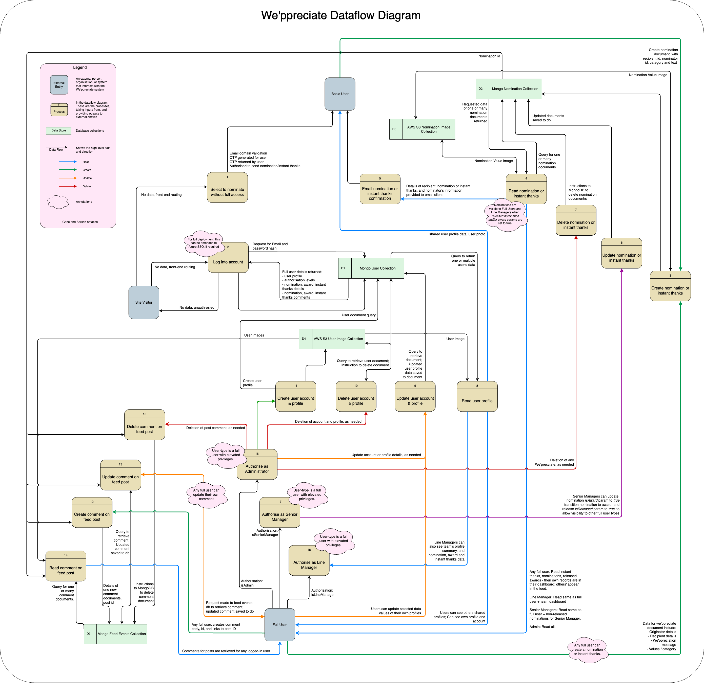

> [!NOTE]
> Viewable on [We'ppreciate's Notion site - Dataflow Diagram](https://weppreciate.notion.site/Data-Flow-Diagram-47398d8544d94a65a338526915426a19?pvs=4)

## R3 - Application Architecture Diagram

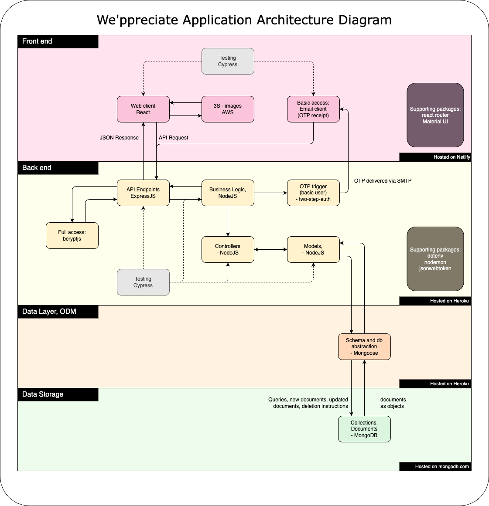

> [!NOTE]
> Viewable on [We'ppreciate's Notion site - Application Architecture Diagram](https://weppreciate.notion.site/Application-Architecture-Diagram-51b1afe2e0a4482192db82302ac318b4?pvs=4)

## R5 - Wireframes
We used Figma for our wireframing, storing all wireframes in one file with a page to represent each unique page set within our application.

> [!NOTE]
> Viewable on [We'ppreciate's Notion site - Wireframes](https://weppreciate.notion.site/Wireframes-85bba971e91a4a6380b062e88355c931?pvs=4) and [Figma - Wireframes](https://www.figma.com/file/Sy9ISYYNwBQNsf13FpUwbR/We'ppreciate---Wireframes?type=design&node-id=2%3A2&mode=design&t=X91eijn8YuUSCsU2-1)

### Development of wireframes
The wireframes were developed over about a 2-week period, commencing once the product requirements and user stories were mostly completed. There were not significant changes in the design aesthetic in this timeframe, but regular check-ins to ensure alignment with the dataflow diagram occurred, and additional buttons were added to ensure almost all planned features were captured in the wireframe.

An example of this includes a discussion that occurred about the ability to edit and delete cards and comments, and how this experience would differ by user permission. We knew that full CRUD would be required, but the design was adjusted once there was an alignment about which user role would be able to perform each task.

Open-source figma component libraries were used to allow us to spend less time creating common buttons, shapes and icons - and more time ensuring the design was laid out logically and application features were captured in the wireframes.

The following component libraries were used in our wireframes:
- [Lookscout Design System - Low-Fi Wireframe Kit](https://www.figma.com/community/file/1266479641987028137)
- [Wireframe Examples + Kit](https://www.figma.com/community/file/1300533276556237596)
- [[Legacy] Wireframe Kit](https://www.figma.com/community/file/769801235736984714/legacy-wireframe-kit)
- [Lookscout - Design System [Free Version]](https://www.figma.com/community/file/1266476307343004834)
- [Notes & Callouts](https://www.figma.com/community/file/1134133416097111991)
- [Wireframes Kit](https://www.figma.com/community/file/1221009141145444839)

### Wireframe screenshots
Each export from Figma contains a number of different wireframe views per page. The images can be enlarged to read all annotations. The initial state of each screen is shown in three devices sizes, though additional screens showing the user interaction may only be shown on the desktop screen size.

### Home
All wireframes:
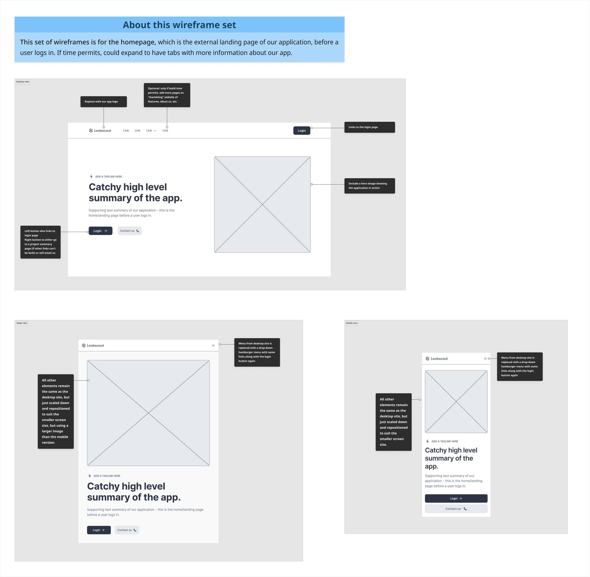

### Login
All wireframes:

Notable screens:
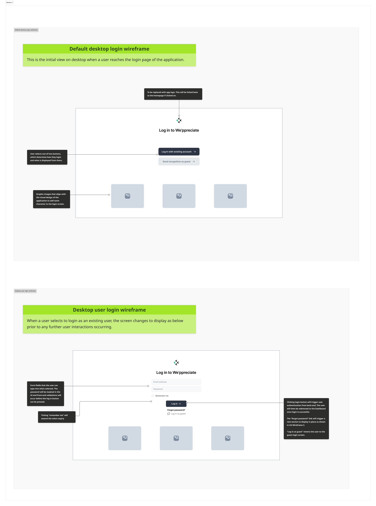

### Dashboard
All wireframes:

Primary Dashboard wireframe:
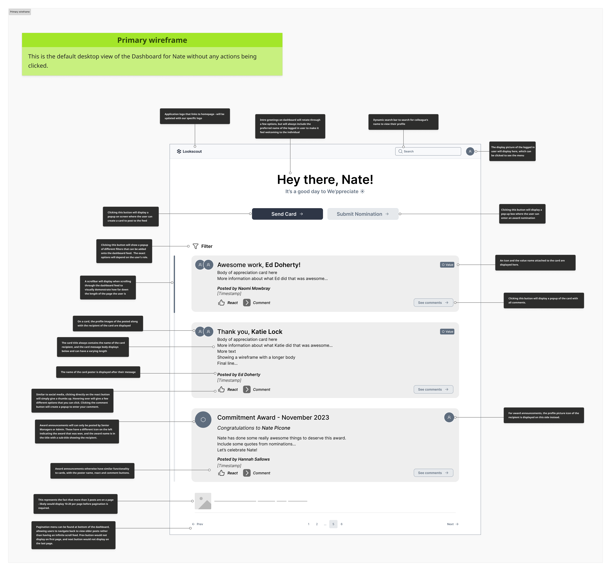

### Profile
All wireframes:

Primary profile screens:
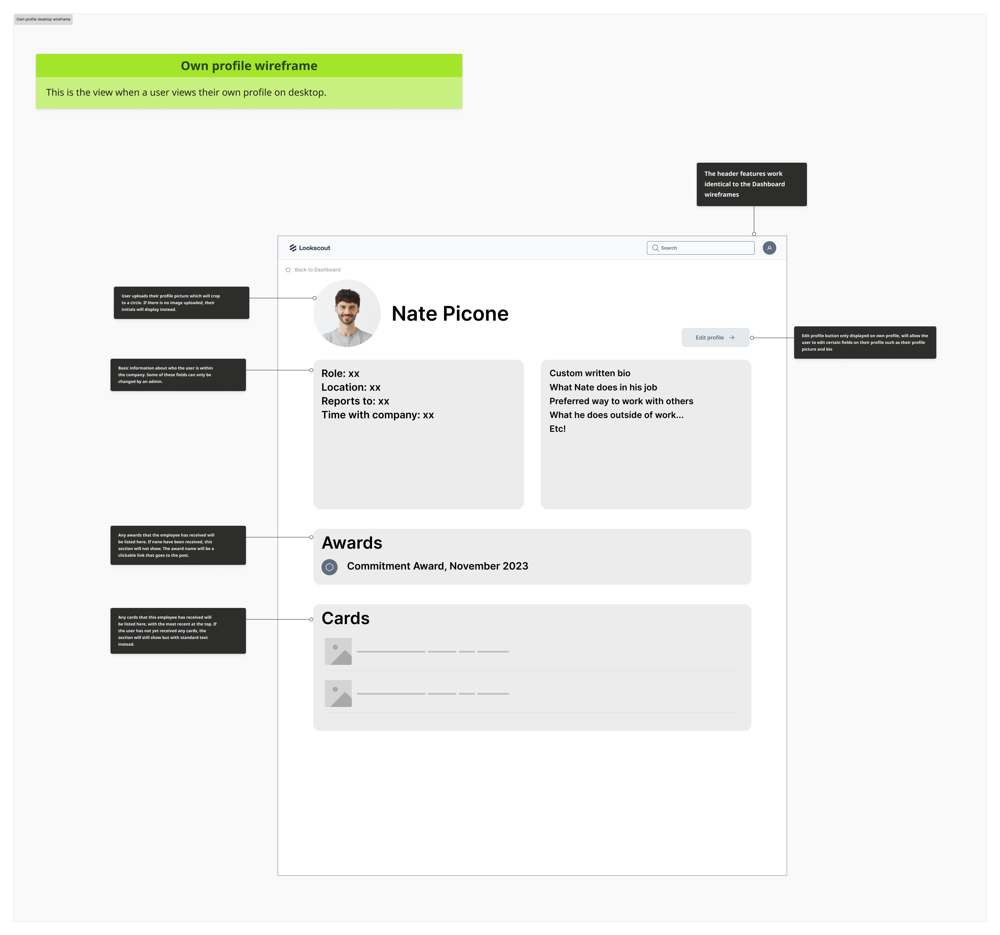
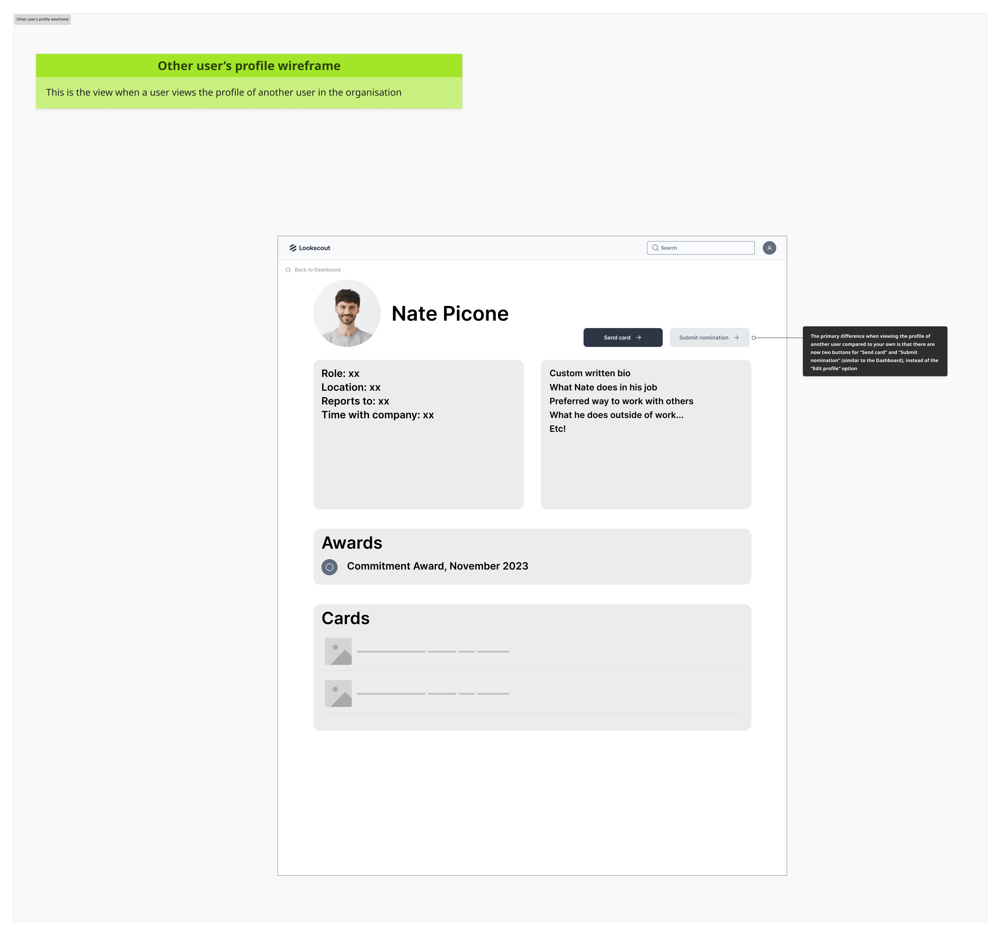

### Settings
All wireframes:

### Reports
All wireframes:

## R6 - Project Management

We split our project into 6x 1-week sprints, starting from 0th week.

> [!NOTE]
> Project Management documents are viewable on the below links. Note that as they are working documents, the live view may differ from the images below
>
>[We'ppreciate's Notion site - Sprints](https://weppreciate.notion.site/096aac0b89cd4d4ba7fcd0b02ce6187a?v=b9b2dde3fc2e4b53b59e3509f8c3d2b2&pvs=4)
>
>[We'ppreciate's Notion site - Tasks](https://weppreciate.notion.site/75b89fa68e894f5f954787c5eeef489f?v=989fd6fd0ad146e4af4e6ada44b70641&pvs=4)
>
>[We'ppreciate's Notion site - Projects](https://weppreciate.notion.site/fd3c53db9a1f4e27b59dcc063b46864a?v=41b6032216174cf59edfa04a8e317941&pvs=4)
>
>[We'ppreciate's Notion site - Meetings](https://weppreciate.notion.site/33e465ae7b2c4bdf9a261acbbf5167e0?v=00a1f910091e4b5c98a984ca396519f6&pvs=4)
>
>[We'ppreciate's Notion site - Documents](https://weppreciate.notion.site/59318e1ab6b840efbb38de4eb82117ec?v=c5f3f0c8a680426482b9cb31b7ec58ce&pvs=4)
>
>[We'ppreciate's Notion site - Wireframes](https://weppreciate.notion.site/Wireframes-85bba971e91a4a6380b062e88355c931?pvs=4)

## Project boards at end Sprint 0

### Sprint board wk0

### Project Board wk0

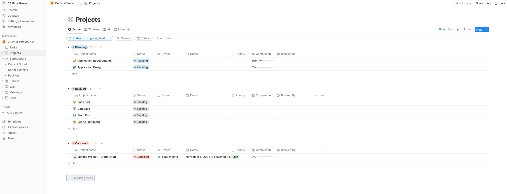

### Task board, by project wk0

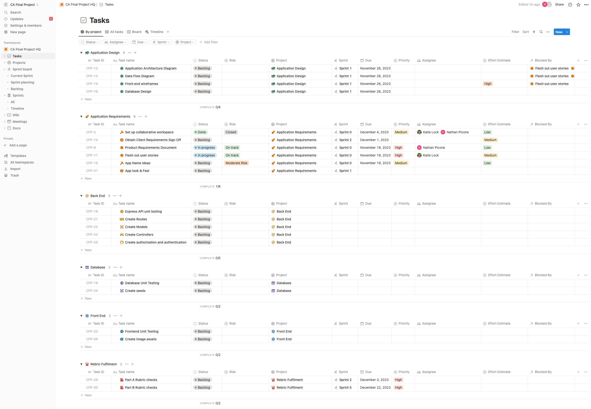

### Task Timeline wk0

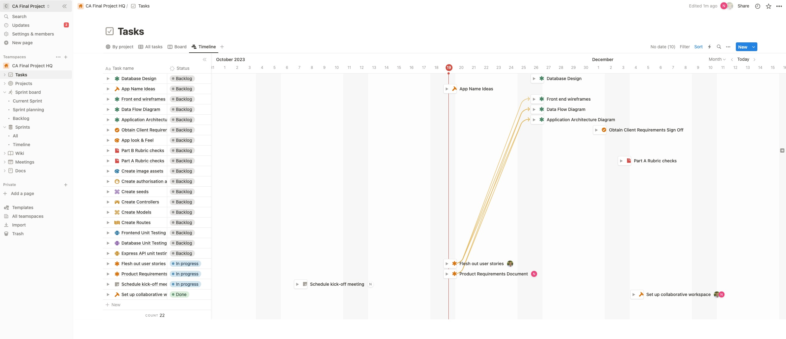

### Documents list wk0

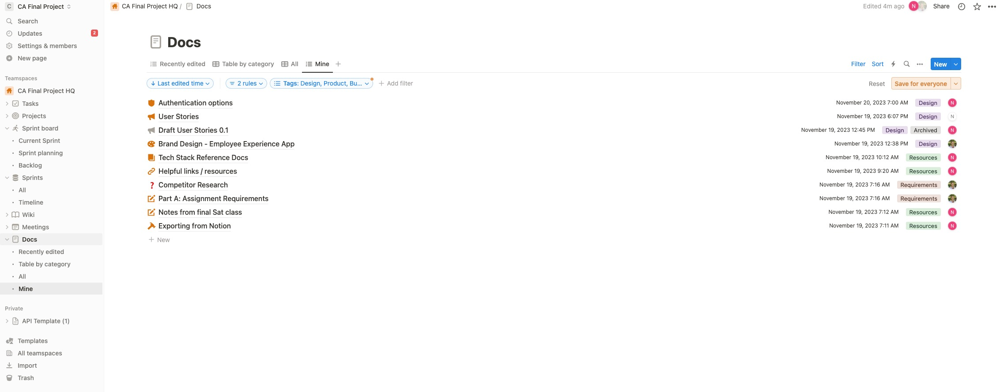

### Meetings wk0

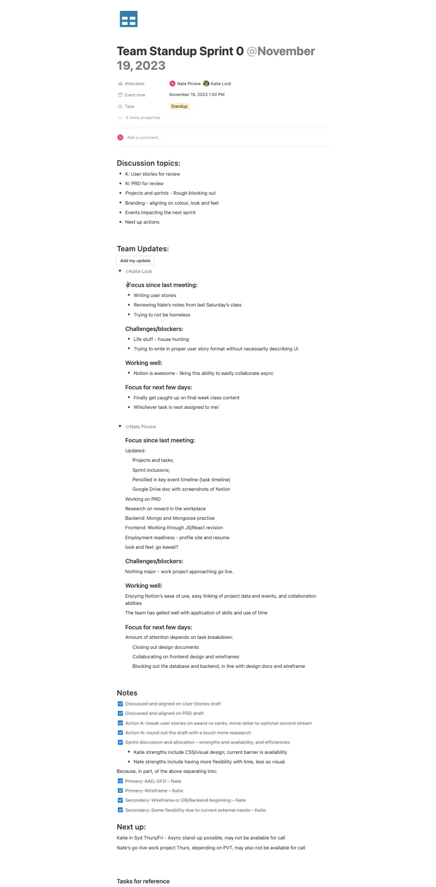

## Project boards at end Sprint 1

### Sprint board wk1

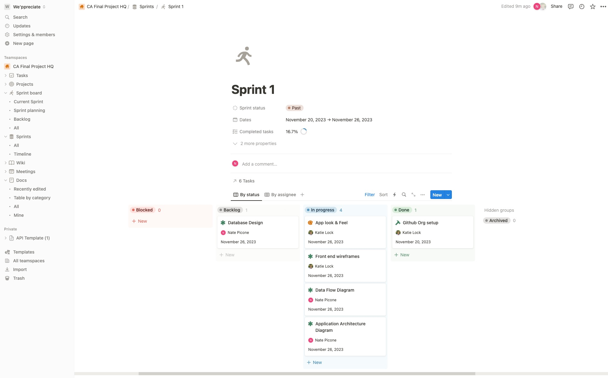

### Project Board wk1

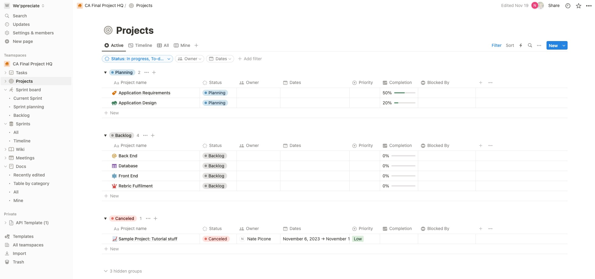

### Task board, by project wk1

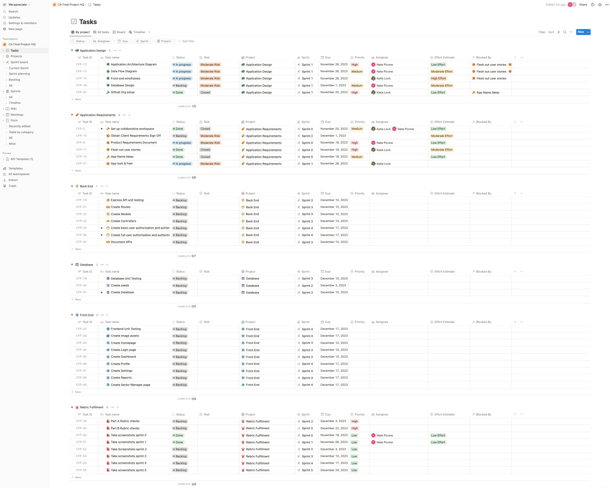

### Task Timeline wk1

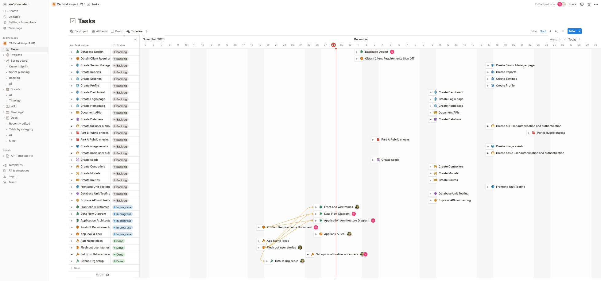

### Documents list wk1

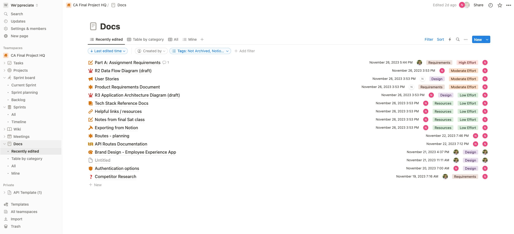

### Meetings wk1

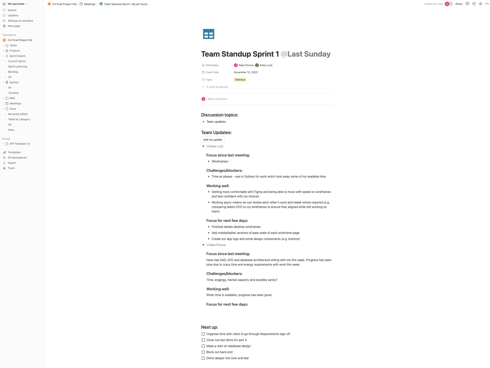

